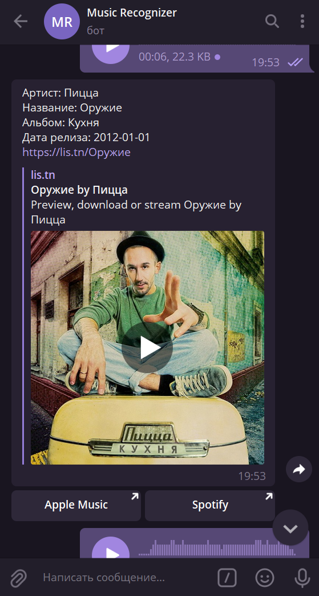

<!-- Иконка -->
<br />
<p align="center">
  <a href="https://github.com/A1ina42/recognize_music_bot">
    
  </a>

  <h3 align="center">Recognize Music Bot</h3>

  <p align="center">
    Бот, который распознает музыку.
    <br />
  </p>
</p>


<!-- О проекте-->
## О проекте

Для распознавания музыки необходимо отправить голосовое сообщение или аудиозапись.


<!-- Установка -->
## Установка
```
npm install
```

### Запуск
```
npm start
```


<!-- Результаты работы программы -->
## Результаты работы программы




<!-- Создано с помощью -->
## Создано с помощью

* [Node.js](https://nodejs.org)
* [telegraf.js](https://telegraf.js.org/)
* [request](https://www.npmjs.com/package/request)
* [dotenv](https://www.npmjs.com/package/dotenv)


